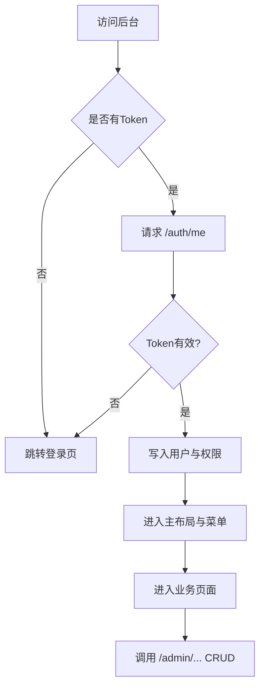

## 1. 产品概述
LightMes 后台管理端（PC）用于管理员/厂长/班组长在浏览器中完成系统管理与主数据维护，并为后续生产闭环模块提供稳定的权限与基础库能力。
- 解决问题：多租户登录、RBAC 权限隔离、主数据（产品/型号/工序/路线/工价）与系统管理（用户/角色/权限/部门/设置/附件/日志）快速可用
- 目标价值：与后端 /api 完整联通，提供一致的 CRUD 体验、统一返回格式适配、可扩展的菜单与页面骨架

## 2. 核心功能

### 2.1 用户角色
| 角色 | 登录方式 | 核心权限 |
|------|----------|----------|
| 超级管理员 | 租户编码+账号密码 | 权限点维护、全局系统配置 |
| 管理员/厂长 | 租户编码+账号密码 | 用户/角色/部门/设置/主数据维护 |
| 班组长 | 租户编码+账号密码 | 主数据查看/部分维护（按后端权限点控制） |
| 员工/客户 | 本项目不覆盖 | 后续在 H5/移动端覆盖 |

### 2.2 功能模块
1. **登录**：租户编码、账号、密码登录；登录后拉取 /auth/me 写入状态
2. **主布局**：侧边菜单 + 顶部栏（当前用户、退出登录）+ 内容区
3. **路由权限**：基于 token + permissions（后端返回）控制路由进入；无权限提示并阻止访问
4. **系统管理**：用户、角色、权限点、部门、设置、附件、操作日志
5. **主数据**：产品、型号、工序、工艺路线、工序工价

### 2.3 页面明细
| 页面名称 | 模块名称 | 功能说明 |
|-----------|-------------|---------------------|
| 登录页 | 登录表单 | tenant_code/username/password；成功后跳转首页 |
| 首页 | 快捷入口 | 系统管理与主数据入口卡片、基础说明 |
| 用户管理 | 列表 | 搜索 keyword、分页 offset/limit、启停用、编辑、创建 |
| 角色管理 | 列表 | 创建/编辑/删除、配置权限点（permission_codes） |
| 权限点管理 | 列表 | 创建/编辑/删除（仅 superuser 可操作） |
| 部门管理 | 列表 | 创建/编辑/禁用、parent_id 选择 |
| 设置管理 | 列表/编辑 | key/value JSON 编辑、删除 |
| 附件管理 | 列表 | 搜索 keyword、uploader_id、查看基础信息 |
| 操作日志 | 列表 | keyword/module/action/user_id 过滤、查看详情 |
| 产品管理 | 列表 | 创建/编辑/禁用、category/unit/description |
| 型号管理 | 列表 | product_id 过滤、创建/编辑/禁用 |
| 工序管理 | 列表 | workshop/std_minutes、创建/编辑/禁用 |
| 工艺路线 | 列表/编辑 | product_id 过滤、steps（seq/process_id）维护、default 标记 |
| 工序工价 | 列表 | sku_id 过滤、sku_id+process_id+unit_price 维护、禁用 |

## 3. 核心流程
1. 用户打开后台 → 未登录跳转登录页
2. 登录成功 → 保存 token → 拉取个人信息 /auth/me → 生成可访问菜单 → 进入首页
3. 进入任意管理页 → 列表加载 → 新增/编辑/删除 → 自动刷新列表

## 4. 界面设计
### 4.1 设计风格
- 主色：深蓝灰 + 高亮蓝（强调动作）
- 布局：左侧固定菜单 + 顶部工具栏 + 内容卡片
- 字体：系统默认字体栈（保证跨平台稳定）
- 交互：列表页统一“查询/重置/新增”操作区，弹窗表单完成新增/编辑

### 4.2 页面设计概览
| 页面名称 | 模块名称 | UI 元素 |
|-----------|-------------|-------------|
| 登录页 | 表单卡片 | 租户编码/账号/密码输入、登录按钮、错误提示 |
| 列表页 | 查询区 | 输入框、选择框、查询/重置按钮 |
| 列表页 | 表格区 | 表格、操作列（编辑/删除/禁用）、分页 |
| 列表页 | 弹窗表单 | 表单项、保存/取消按钮 |

### 4.3 响应式
桌面优先，最小适配 1280px；在窄屏时侧边栏可折叠。

