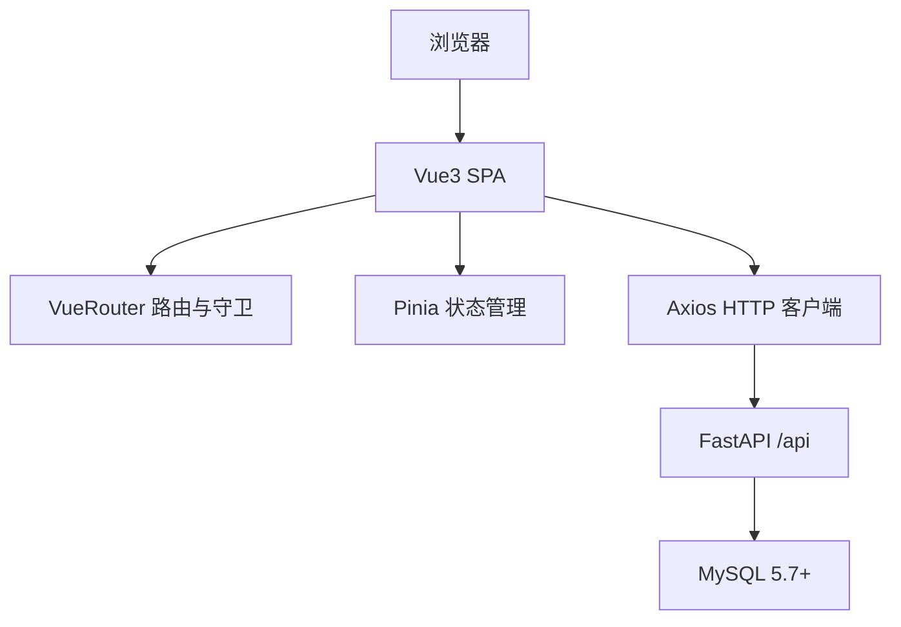

## 1. 架构设计


## 2. 技术说明
- 前端：Vue@3 + TypeScript + Vite
- 状态：Pinia
- 路由：Vue Router
- UI：Element Plus
- HTTP：Axios（统一封装，适配 {code,msg,data}）
- 鉴权：Bearer Token（localStorage 持久化）+ /auth/me 拉取 permissions

## 3. 路由定义
| 路由 | 用途 |
|------|------|
| /login | 登录 |
| / | 主布局重定向到 /home |
| /home | 首页 |
| /system/users | 用户管理 |
| /system/roles | 角色管理 |
| /system/permissions | 权限点管理 |
| /system/departments | 部门管理 |
| /system/settings | 设置管理 |
| /system/attachments | 附件管理 |
| /system/operation-logs | 操作日志 |
| /master/products | 产品 |
| /master/skus | 型号 |
| /master/processes | 工序 |
| /master/process-routes | 工艺路线 |
| /master/process-prices | 工价 |

## 4. API 定义
### 4.1 统一返回结构
```ts
export type ApiResp<T> = { code: number; msg: string; data: T }
```

### 4.2 鉴权与请求头
- 登录：POST /api/auth/login
- 登录成功返回：data.access_token（保存为 token）
- 通用请求头：Authorization: Bearer {token}
- 用户信息：GET /api/auth/me（返回 roles/permissions）

### 4.3 系统管理
- 用户：/api/admin/system/users
- 角色：/api/admin/system/roles（含 PUT /{id}/permissions）
- 权限点：/api/admin/system/permissions
- 部门：/api/admin/system/departments
- 设置：/api/admin/system/settings
- 附件：/api/admin/system/attachments
- 日志：/api/admin/system/operation-logs

### 4.4 主数据
- 产品：/api/admin/master/products
- 型号：/api/admin/master/skus
- 工序：/api/admin/master/processes
- 工艺路线：/api/admin/master/process-routes
- 工价：/api/admin/master/process-prices

## 5. 前端工程结构
- src/main.ts：入口，注册路由、Pinia、Element Plus
- src/router：路由定义、路由守卫、按权限过滤可见菜单
- src/stores：auth（token、me、permissions）
- src/api：axios 实例与各模块 API
- src/views：页面（系统管理、主数据）
- src/components：通用 CRUD 表格、弹窗表单（按配置生成）

## 6. 权限策略
- 必须先登录并拿到 /auth/me.permissions
- 路由 meta 中声明 permissionCodes
- 路由守卫校验：
  - 未登录：跳转 /login
  - 已登录但无权限：跳转到 /home 并提示无权限
- 菜单按 permissionCodes 动态过滤

