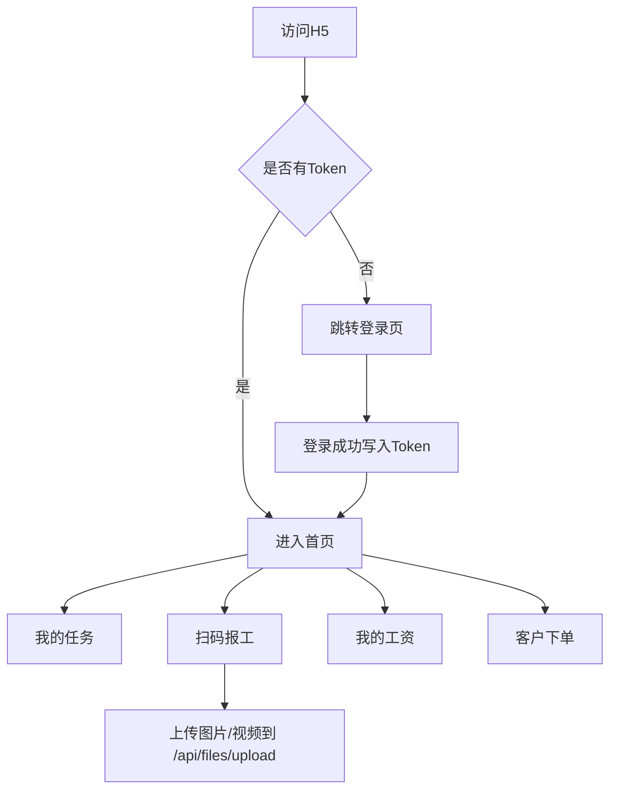

## 1. 产品概述
LightMes 移动端（H5）用于员工在手机上扫码报工与查看计件工资，同时为客户自助下单提供可扩展入口。
- 解决问题：员工端高频报工要支持扫码与多媒体证据上传；客户端要能快速创建订单并查询进度（本期先预留路由与页面骨架）
- 目标价值：与后端 /api 统一联通，适配统一返回 `{code,msg,data}`，token 鉴权可复用，页面可独立发布

## 2. 核心功能

### 2.1 用户角色
| 角色 | 登录方式 | 核心权限 |
|------|----------|----------|
| 员工 | 账号密码 | 查看我的任务、扫码报工、查看我的工资 |
| 班组长/质检 | 账号密码 | 本期仅复用登录与路由框架，后续扩展审核入口 |
| 客户 | 账号密码/手机号（后续） | 本期预留客户下单入口与路由骨架 |

### 2.2 功能模块
1. **登录**：账号密码登录；登录后保存 token
2. **我的任务**：展示待报工任务列表（本期先占位结构，后续对接任务 API）
3. **扫码报工**：支持输入合格数/不良数；支持上传图片/视频作为证据；提交后给出成功提示（本期先完成上传与页面骨架）
4. **我的工资**：展示个人工资汇总与明细入口（本期先占位结构，后续对接工资 API）
5. **客户下单**：客户选择产品/型号与数量提交订单（本期先占位结构，后续对接下单 API）

### 2.3 页面明细
| 页面名称 | 模块名称 | 功能说明 |
|-----------|-------------|---------------------|
| 登录页 | 登录表单 | username/password；成功后进入首页 |
| 首页 | 入口导航 | TabBar/入口卡片跳转到“我的任务/扫码报工/我的工资/客户下单” |
| 我的任务 | 列表 | 任务卡片（工单/工序/数量/截止）；点击进入报工页（后续） |
| 扫码报工 | 报工表单 | 扫码/手填任务码、合格数、不良数、上传图片/视频、提交 |
| 我的工资 | 汇总/明细入口 | 本月预估/已审核金额（后续）、明细列表（后续） |
| 客户下单 | 下单表单 | 选择产品/型号、数量、交期（后续）、提交（后续） |

## 3. 核心流程
1. 用户打开 H5 → 若无 token 跳转登录
2. 登录成功 → 写入 token → 进入首页
3. 员工扫码报工 → 上传图片/视频证据 → 提交报工（后续对接）
4. 员工进入“我的工资” → 查看汇总与明细（后续对接）
5. 客户进入“客户下单” → 创建订单（后续对接）

## 4. 界面设计
### 4.1 设计风格
- 设备优先：移动端触控优先，单手操作
- 组件体系：Vant 4，表单与列表统一样式
- 色彩：浅色背景 + 强调色按钮（主操作统一）
- 信息密度：卡片化列表，关键字段优先展示

### 4.2 页面设计概览
| 页面名称 | 模块名称 | UI 元素 |
|-----------|-------------|-------------|
| 登录页 | 表单卡片 | 输入框、登录按钮、错误提示 |
| 首页 | TabBar | 任务/报工/工资/下单入口 |
| 列表页 | 卡片列表 | 标题、字段行、状态标签、下拉刷新（后续） |
| 报工页 | 表单 | 数字输入、上传组件、提交按钮、成功提示 |

### 4.3 响应式
移动端优先，适配 360px 起；横屏与平板保持组件可用性与信息对齐。
