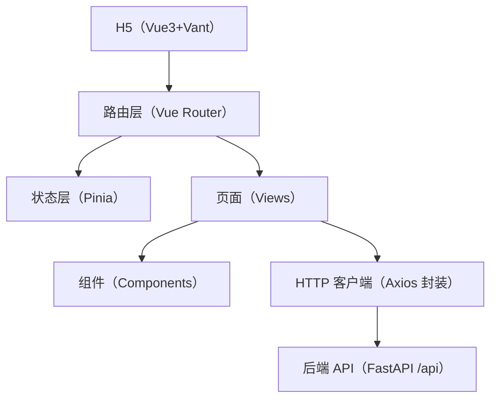

## 1. 架构设计



## 2. 技术说明
- 前端：Vue 3 + TypeScript + Vite
- UI：Vant 4
- 路由：Vue Router 4
- 状态：Pinia
- 请求：Axios
- 统一返回：后端返回 `{code:number, msg:string, data:any}`；前端将其解包为 `data`，并在 `code != 200` 时统一提示错误
- 鉴权：token 存储在本地（localStorage），请求头 `Authorization: Bearer <token>`（或按后端现状兼容 `token` 头，开发期可双发）

## 3. 路由定义
| 路由 | 页面 | 说明 |
|------|------|------|
| /login | 登录 | 白名单路由 |
| / | 首页 | TabBar 入口页 |
| /tasks | 我的任务 | 员工任务入口（预留） |
| /report | 扫码报工 | 员工报工入口（含上传） |
| /wages | 我的工资 | 工资汇总入口（预留） |
| /customer/order | 客户下单 | 客户下单入口（预留） |

## 4. API 定义（前端视角）

### 4.1 统一响应类型
```ts
export type ApiResp<T> = {
  code: number
  msg: string
  data: T
}
```

### 4.2 登录（占位，按后端实际调整）
- URL：`POST /api/auth/login`
- Body：`{ username: string; password: string }`
- Response：`{ code, msg, data: { token: string } }`

### 4.3 文件上传（本期必须可用）
- URL：`POST /api/files/upload`
- Content-Type：`multipart/form-data`
- FormData：`file: File`
- Response：`{ code, msg, data: { url: string; file_id?: number; mime_type?: string } }`（以实际后端为准，前端至少兼容 `data.url`）

### 4.4 我的任务/报工/工资/下单（预留）
- 我的任务：`GET /api/tasks/my`
- 提交报工：`POST /api/reports`
- 我的工资：`GET /api/wages/my`
- 客户下单：`POST /api/customer/orders`

## 5. 关键实现约束
- 所有页面必须在无后端联调时也能运行（占位数据 + 结构完整）
- 不能引入 Docker/容器相关依赖
- 不使用动态 import 做核心路由懒加载（便于部署与排障）
- 上传组件支持图片与视频，单个文件上传，返回后回填到表单中
